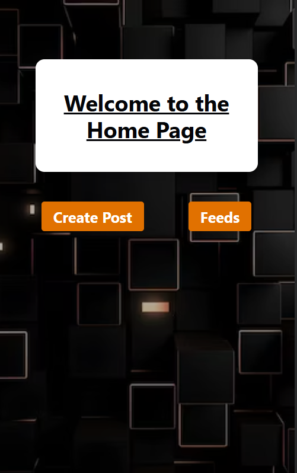
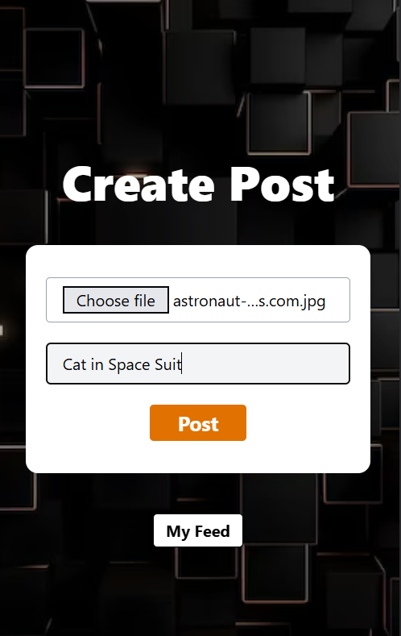
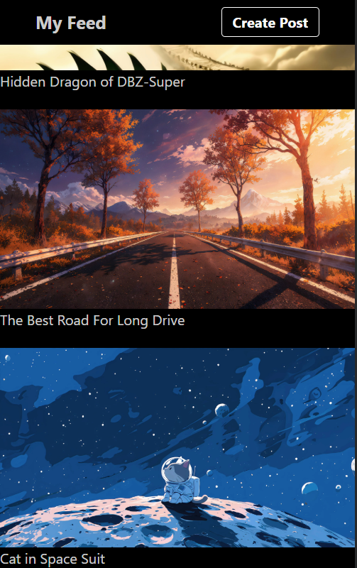

# 📸 SnapFeed — Mobile Image Feed App

A full-stack mobile-first social feed application where users can upload images with captions and view them in a personal feed. Built while learning **Node.js & Express** from [Sheryians Coding School](https://www.youtube.com/@sheryians) on YouTube.

---

## 📱 Screenshots

<div align="center">

| Home Page | Create Post | My Feed |
|:---------:|:-----------:|:-------:|
|  |  |  |

</div>

> ⚠️ This app is designed and optimized for **mobile view only**.

---

## ✨ Features

- 📤 **Upload posts** — Pick an image from your device and add a caption
- 🖼️ **Image storage** — Images are hosted via **ImageKit CDN**
- 📋 **Feed view** — All posts display in a scrollable mobile feed
- 🔄 **Persistent data** — Posts are saved to a **MongoDB** database
- ⚡ **Fast navigation** — Seamless routing with React Router DOM

---

## 🛠️ Tech Stack

### Frontend
| Technology | Purpose |
|---|---|
| **React** | UI framework |
| **Tailwind CSS** | Styling |
| **React Router DOM** | Client-side routing |
| **Axios** | HTTP requests to backend |

### Backend
| Technology | Purpose |
|---|---|
| **Node.js** | Runtime environment |
| **Express.js** | REST API server |
| **MongoDB** | Database for storing post data |
| **ImageKit** | Media storage & CDN for images |
| **Multer** | Handling file uploads |

### Dev Tools
| Tool | Purpose |
|---|---|
| **Postman** | API testing during development |

---

## 📂 Project Structure

```
snapfeed/
├── backend/
|   ├──src/
│   |   ├── model/
│   │   |   └── post.model.js       # Mongoose schema
│   |   ├── db/
│   │   |   └── db.js               # Database Connection
│   |   ├── services/
│   │   |   └── storage.service.js      # ImageKit configuration
│   |   └── app.js                  # Express app creating server
|   ├── server.js                   # Starting the server
│   └── .env                        # Environment variables
│
└── frontend/
    ├── src/
    │   ├── pages/
    │   │   ├── Home.jsx         # Landing page
    │   │   ├── CreatePost.jsx   # Upload image & caption
    │   │   └── Feed.jsx         # My Feed page
    │   ├── App.jsx
    │   └── main.jsx
    └── index.html
```

---

## 🚀 Getting Started

### Prerequisites
- Node.js installed
- MongoDB URI (Atlas or local)
- ImageKit account (public key, private key, URL endpoint)

### 1. Clone the repository

```bash
git clone https://github.com/your-username/snapfeed.git
cd snapfeed
```

### 2. Setup the Backend

```bash
cd backend
npm install
```

Create a `.env` file in the `/backend` directory:

```env
MONGO_URI=your_mongodb_connection_string
IMAGEKIT_PUBLIC_KEY=your_imagekit_public_key
IMAGEKIT_PRIVATE_KEY=your_imagekit_private_key
IMAGEKIT_URL_ENDPOINT=your_imagekit_url_endpoint
PORT=3000
```

Start the backend server:

```bash
node app.js
```

### 3. Setup the Frontend

```bash
cd frontend
npm install
npm run dev
```

---

## 🔌 API Endpoints

| Method | Endpoint | Description |
|--------|----------|-------------|
| `POST` | `/create-post` | Upload image + caption, save to DB |
| `GET`  | `/feed` | Fetch all posts for the feed |

---

## 📸 How It Works

1. User lands on the **Home Page** and chooses to create a post or view their feed.
2. On the **Create Post** page, the user picks an image file and adds a caption, then hits **Post**.
3. The image is uploaded to **ImageKit** via the backend; the returned URL and caption are saved to **MongoDB**.
4. The **My Feed** page fetches all posts from the database using **Axios** and renders them in a scrollable list.

---

## 🎓 Learning Credits

Built while following the **Full Stack Development** series by [Sheryians Coding School](https://www.youtube.com/@sheryians) on YouTube. Huge thanks for making backend development approachable and fun!

---

## 📄 License

This project is open source and available under the [MIT License](LICENSE).
